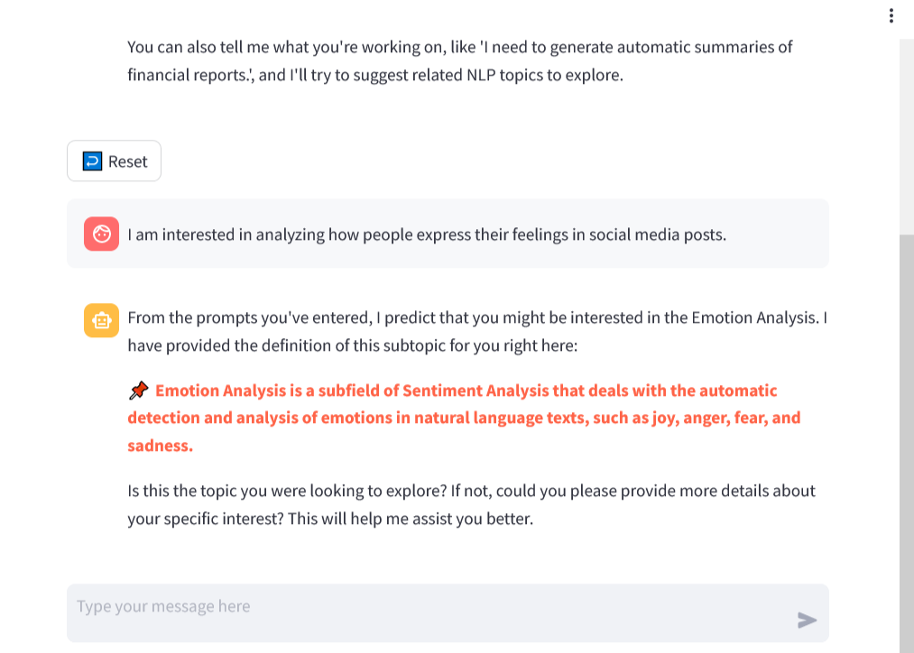
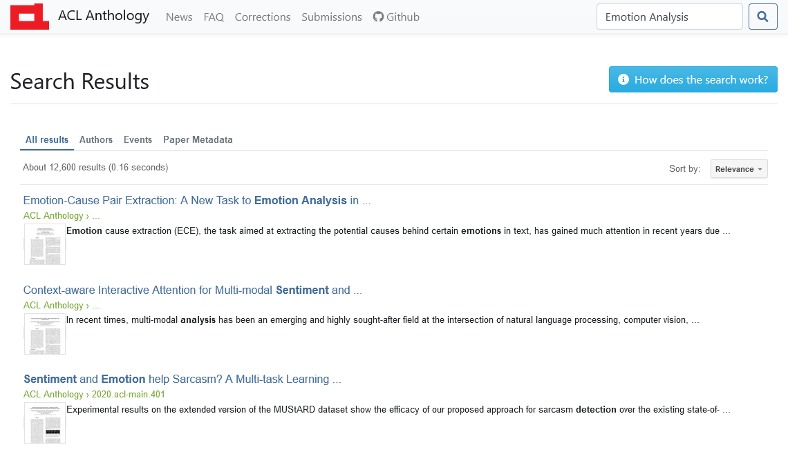

# Conversational Exploratory Search of Scholarly Publications Using Knowledge Graphs

## Overview
This GitHub repository contains the code, models, and data resources associated with the paper: "Conversational Exploratory Search of Scholarly Publications Using Knowledge Graphs", published in ICNLSP 2024.

## Repository Structure
* **abstract-classification-service**: Includes the scripts for classifying sentences from the publication abstracts.
* **clustering-service**: Contains the code for publication text clustering and cluster naming.
* **database-dump**: Includes two data dumps from the Neo4j and Weaviate databases.
* **evaluation-questionnaire**: Provides the evaluation questionnaire, screenshots for both interfaces, and the questionnaire responses.
* **llm-api**: Contains the code for serving the large language model with corresponding endpoints for prompting.
* **neo4j-service**: Provides the scripts for setting up the Neo4j graph database with all its functionalities.
* **streamlit-app**: Includes the code for the chat interface.
* **rasa-app**: Contains all files and source code of the conversational agent built with the RASA framework.
* **topic-classification-service**: Provides the fine-tuned model and inference scripts for the topic classification using the Weaviate vector DB.

## Prompts
Listed below are the used prompts for the large language models. Dynamically inserted variables are enclosed within curly brackets. Note that Prompt 3 is not implemented and was only used for experiments for the classification of research topics.

Prompt 1: Cluster Name Generation (Zephyr-7B-Beta)

"""
Considering the themes and topics from the following TFIDF cluster tag: "{tfidf_cluster_name}", please provide a concise and descriptive name for a cluster that includes these {len(paper_list)} academic papers: \n   
{paper_titles_formatted}
Respond with just the cluster name, based on the overarching themes evident in the titles and the TFIDF tag. Don't include the original TFIDF cluster tag and the word 'Cluster' in your response.
"""

Prompt 2: Comparative Text Summarization (Zephyr-7B-Beta)

Prompt 2.1  
"""
Please provide a comparative analysis of the objectives of two scientific papers.   
Refer the papers with their real ids:   
Paper {id_a}'s objective is: {obj1}   
Paper {id_b}'s objective is: {obj2}   
Highlight the key differences and similarities between Paper {id_a} and Paper {id_b}. Use simple language.:
"""
 
  
Prompt 2.2  
"""
Please provide a comparative analysis of the results of two scientific papers.:   
Refer the papers with their real ids:   
Results of Paper {id_a}: {res1}   
Results of Paper {id_b}: {res2}   
Highlight the key differences and similarities between Paper {id_a} and Paper {id_b}. Use simple language.:
"""
  
 
Prompt 2.3  
"""
Please provide a comparative analysis of the TLDR of two scientific papers.:   
TLDR of Paper {id_a}: {tldr1}   
TLDR of Paper {id_b}: {tldr2}   
Highlight the key differences and similarities between Paper {id_a} and Paper {id_b}. Use simple language.:
"""

Prompt 3: LLM-Based Research Topic Classification (GPT-3.5-Turbo)

"""
You are supposed to classify a query into one of the topics provided. These topics are various fields of NLP. Your answer should be in the following format: *topic name*.   
Nothing else should be included in the output.   
Make sure there is no extra punctuation including full stops, quotation marks or anything of that sort. You are supposed to EXACTLY use the topics from the list provided.
If you think it is a random question and not in the field of NLP, then return the topic as 'none'.   
You can only provide your answer from the following topics and the topics are: 
Multimodality   
Natural Language Interfaces   
Semantic Text Processing   
Semantic Analysis   
Syntactic Text Processing   
Linguistic and Cognitive NLP   
Responsible NLP   
Reasoning   
Multilinguality   
Information Retrieval   
Information Extraction and Text Mining   
Text Generation   
Query: {query}.   
Topic:  
"""

## Interface Screenshots
Below are screenshots showing a visual side-by-side comparison of the conversational and graphical interfaces from the human evaluation study.
<table>
  <tr>
    <td style="text-align: center;">
      <h4>Conversational Interface</h4>
      
    </td>
    <td style="text-align: center;">
      <h4>Graphical Interface</h4>
      
    </td>
  </tr>
</table>
